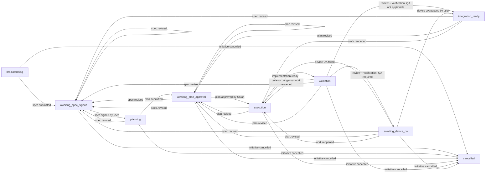

# Harness Phase 2: Durable Initiative State and Evidence Design

- **Date:** 2026-07-25
- **Status:** Approved by product owner
- **Scope:** Repository-tracked initiative state, evidence-bound gates, deterministic status reporting, and verification receipts
- **Depends on:** Harness Phase 1 at `8096bbf`

## Decision Summary

Phase 2 will add one immutable, machine-readable event ledger per initiative.
Current workflow state will be derived by replaying those events against one
canonical state-machine definition. Specs, plans, reviews, QA records, Git
revisions, and verification results will be referenced as evidence; chat,
filenames, checkboxes, and branch names will never be treated as approvals.

This phase ends at `integration_ready`. That state means the initiative has
valid local evidence and is waiting for an explicit user request for any push,
PR, merge, or other repository integration action. Phase 2 will not perform or
record those actions.

Planner/worker task trees, automatic dispatch, PR orchestration, session
archival, and worktree cleanup remain separate later phases.

## Why This Phase Exists

Phase 1 made the live harness trustworthy: policy is canonical, 16 adapters are
generated, known semantic contradictions are zero, and the six-check
verification contract is executable. It deliberately left initiative state
out of scope.

The remaining coordination problem is measurable:

- `docs/superpowers/` contains 47 specs, 65 plans, 6 reviews, and 1 QA record.
- Only 27 specs, 2 plans, 2 reviews, and no QA record have explicit status
  metadata.
- Existing status words are inconsistent: `Draft`, `Design`, `Approved`,
  `Revised`, `awaiting spec sign-off`, and `awaiting plan approval` do not form
  one executable lifecycle.
- Six worktrees and eight local branches can coexist. A single global
  “active task” file would be ambiguous and create merge contention.
- The generated Claude status command still asks Sarah to reconstruct state by
  reading artifacts. It correctly forbids inference from chat, but it has no
  durable state source to read.

The result is repeated archaeological work at every resume or handoff. An agent
must scan conversations, documents, Git state, reviews, verification output,
and QA notes before it can safely answer “where are we?” That keeps oversized
session context valuable for too long and makes routine coordination depend on
model judgment.

Phase 2 moves that responsibility into a small deterministic tool. This applies
the central lesson from the prior session audit and Cursor harness research:
use model reasoning for decisions and review; use executable state and evidence
for repeated coordination.

## User and Team Outcome

For every initiative created after Phase 2:

- a fresh checkout can report the exact phase, owner, durable evidence,
  blockers, and next legal transition without chat history;
- handoffs need an initiative ID and focused artifacts, not a full inherited
  transcript;
- user gates remain visible and cannot be inferred or silently skipped;
- review, verification, and QA evidence become stale automatically when the
  delivery content changes;
- concurrent writers fail explicitly instead of silently overwriting state;
- agents spend less time re-reading history and more time on the current
  bounded task.

The daily cost is one typed event at meaningful initiative transitions. Worker
subtasks, conversational updates, test attempts, and routine implementation
steps are intentionally not recorded.

## Design Principles

1. **State is explicit, not inferred.** Git and filesystem facts may validate a
   record, but they do not create approvals.
2. **One initiative, one ledger.** There is no global active-state authority.
3. **History is append-only.** Corrections and revisions are new events; old
   events are never rewritten.
4. **Evidence is content-bound.** Gate records reference repository-relative
   paths and exact SHA-256 digests.
5. **Delivery evidence is revision-bound.** Review, verification, and QA must
   cover the same delivery content digest.
6. **Policy remains authoritative.** The machine maps to Phase 1 rule IDs; it
   does not restate or weaken their meaning.
7. **Status is read-only.** Reporting cannot repair, advance, or infer state.
8. **Mutation is narrow and atomic.** Typed event commands write one new event
   or nothing.
9. **The ledger is auditable, not identity infrastructure.** It records the
   stated decision authority and evidence basis but does not cryptographically
   authenticate a human.
10. **No integration authority is automated.** `integration_ready` still waits
    for the user.

## Scope

### In scope

- A versioned canonical initiative state machine.
- One repository-tracked immutable event ledger per initiative.
- Strict event, path, transition, role, and evidence validation.
- Deterministic state projection from event history.
- Artifact hashing for specs, plans, reviews, and QA records.
- A delivery content digest that survives evidence-only commits but changes
  when implementation, tests, harness policy, specs, or plans change.
- Dependency-free commands to initialize, record, validate, list, verify, and
  report initiative state.
- Structured recording of the existing six-check `verify:pr` result.
- Read-only workflow validation inside `harness:check`, relevant staged-file
  checks, and CI.
- Generated policy and Claude commands that use the workflow CLI rather than
  reconstructing state from prose.
- A bounded dogfood record for Phase 2 after the tool is implemented.
- Unit, integration, corruption, concurrency, and failure-path tests.

### Out of scope

- Product behavior or any `src/`, Expo, native, SQLite, or migration change.
- A planner/worker task tree or automatic subagent dispatch.
- Automatic commit, push, PR creation/update, review assignment, merge, rebase,
  or branch mutation.
- GitHub or other remote-service queries.
- Device testing, generated QA verdicts, or inferred QA completion.
- Session creation, transcript ingestion, handoff, archival, or deletion.
- Worktree creation, removal, pruning, or generated-directory cleanup.
- Backfilling historical initiatives other than the explicit Phase 2 dogfood
  record.
- Rewriting, moving, or normalizing historical specs, plans, reviews, or QA
  files.
- Model routing, token accounting, or model-cost optimization.
- Authentication tokens, signing infrastructure, or an external identity
  provider.
- New npm packages, native modules, databases, or external services.

## Architecture Options

### Option A — Immutable event files with deterministic replay

**Recommended.**

Every transition creates one JSON file. Each event names and hashes its parent.
State is replayed from the files and never stored as a second mutable
projection.

Advantages:

- Git preserves a readable transition history.
- A writer cannot erase another transition through last-write-wins behavior.
- Concurrent branch forks are detected rather than silently resolved.
- Historical event edits invalidate the chain.
- Recovery and status do not depend on a cache.

Cost:

- Each initiative creates tens of small files instead of one file.
- The store needs sequence, parent-chain, lock, and atomic-write validation.

Initiative histories are small, so this is the best reliability/complexity
trade-off.

### Option B — One mutable JSON document with an embedded event array

This is simpler to write atomically, but every transition rewrites the whole
history. Concurrent agents can conflict on or replace the same file, and the
Git diff obscures the one event that changed. It is rejected.

### Option C — Infer state or store it in SQLite

Inferring from Git, Markdown headers, filenames, checkboxes, or chats preserves
the ambiguity this phase exists to remove. SQLite is not branch-friendly or
reviewable and would couple Node harness tooling to an inappropriate database
surface. Both are rejected.

## Repository Layout

```text
harness/
  workflow/
    state_machine.json

scripts/harness/
  workflow.js
  lib/workflow/
    schema.js
    machine.js
    store.js
    projection.js
    evidence.js
    git_revision.js
    status.js
  __tests__/
    workflow_schema.test.js
    workflow_machine.test.js
    workflow_store.test.js
    workflow_evidence.test.js
    workflow_status.test.js
    workflow_integration.test.js

docs/superpowers/initiatives/
  <initiative-id>/
    events/
      000001-<event-hash>.json
      000002-<event-hash>.json
```

Existing evidence stays in its established location:

```text
docs/superpowers/specs/
docs/superpowers/plans/
docs/superpowers/reviews/
docs/superpowers/qa/
```

Events reference those files. They do not copy, move, or rewrite them.

`harness/manifest.json` will register the workflow machine and its validation
contract. `harness/policy/workflow.md` remains the human-readable authority.
`state_machine.json` is its executable mapping: state IDs, event types, allowed
roles, transitions, and guard identifiers. Guard identifiers reuse Phase 1
rules such as `GATE-SPEC-SIGNOFF`, `LEAD-PLAN-APPROVAL`,
`LEAD-REVIEW-VERDICT`, and `GATE-DEVICE-QA`.

## Event Model

Each event uses a strict versioned envelope:

```json
{
  "schemaVersion": 1,
  "initiativeId": "2026-07-25-example",
  "sequence": 2,
  "type": "spec.signed",
  "recordedAt": "2026-07-25T10:00:00.000Z",
  "recordedBy": {
    "role": "sarah"
  },
  "parent": {
    "sequence": 1,
    "eventHash": "sha256-of-the-canonical-parent-event"
  },
  "payload": {},
  "eventHash": "sha256-of-this-canonical-event-with-eventHash-omitted"
}
```

The first event has no parent. The filename must match its six-digit sequence
and full event hash. Unknown fields, versions, event types, roles, or payload
keys are errors rather than being ignored.

Event hashing is self-verifying, including for the current leaf:

1. recursively sort every object key;
2. serialize as UTF-8 JSON with two-space indentation, LF line endings, and one
   trailing LF;
3. omit only the top-level `eventHash` while computing SHA-256;
4. insert that full digest as `eventHash`;
5. serialize again using the same canonical format;
6. name the file `000002-<full-event-hash>.json`.

Validation recomputes the self-hash, compares the filename, and requires the
stored bytes to equal canonical serialization. A repository `.gitattributes`
rule fixes initiative JSON to `text eol=lf`, so checkout line-ending conversion
cannot invalidate a valid chain. A child references the parent's sequence and
self-hash.

Gate events distinguish the authority that made a decision from the role that
recorded it:

```json
{
  "authority": {
    "decisionBy": "user",
    "recordedBy": "sarah",
    "basis": "Explicit approval in the MoneyApp Phase 2 task"
  }
}
```

This is an auditable attestation, not proof of identity. The tool does not gain
permission to act on the user's behalf merely because an event names the user.

Artifact evidence uses repository-relative paths:

```json
{
  "path": "docs/superpowers/specs/2026-07-25-example-design.md",
  "sha256": "sha256-of-the-exact-file-bytes"
}
```

Paths must be tracked, normalized, inside the repository, and free of symlink
escapes. The latest active artifact digest must match the working tree.
Historical digests remain audit references to Git history after a deliberate
revision event changes the same file.

Initiative metadata is carried by `initiative.created`:

- immutable initiative ID and title;
- owning branch and base commit;
- creation record;
- no absolute worktree path, because that is machine-specific.

The ID is a lowercase date-prefixed slug and must match its directory.

## Delivery Content Digest

Review, verification, and QA must refer to the same `contentDigest`. Binding
only to `HEAD` is insufficient because committing a workflow event or review
record would change `HEAD` without changing the delivery.

They must also refer to the same `validationCycleId`, which is the event hash of
the current `implementation.ready` event. A new implementation-ready event
creates a new cycle even when its content digest matches an earlier cycle.
Review changes, failed Device QA, a revision, or `work.reopened` invalidates the
prior cycle. This prevents old approvals from being reused after a same-byte
revert or a process-only remediation.

The digest is computed from the sorted paths and exact bytes of all tracked
files, excluding only evidence that must not invalidate the delivery:

- `docs/superpowers/initiatives/**`;
- `docs/superpowers/reviews/**`;
- `docs/superpowers/qa/**`.

Specs, plans, application code, tests, harness policy, package metadata, and CI
configuration remain inside the digest. Changing any of them makes delivery
evidence stale.

Before recording review, verification, QA, or integration readiness, the CLI
requires:

- the current branch to match the initiative;
- no dirty tracked or untracked files outside the excluded evidence paths;
- every referenced artifact to be tracked;
- a full recomputation of the content digest.

Delivery evidence also records the branch and human-readable Git `HEAD` for
diagnostics. The content digest, not `HEAD`, is the cross-evidence equality
key.

## State Model



Primary phases:

1. `brainstorming`
2. `awaiting_spec_signoff`
3. `planning`
4. `awaiting_plan_approval`
5. `execution`
6. `validation`
7. `awaiting_device_qa`
8. `integration_ready`
9. `cancelled`

`integration_ready` is the final successful Phase 2 state. It is deliberately
not `merged`, `shipped`, or `complete`.

Blocking is an overlay, not a phase. `blocker.opened` retains the initiative's
phase and owner; `blocker.resolved` clears it. This preserves the work context
and prevents a generic blocked state from hiding which gate remains active.
An unresolved critical-trigger blocker prevents forward transitions.

## Events and Guards

| Event | Result | Required evidence and authority |
|---|---|---|
| `initiative.created` | `brainstorming` | ID, title, non-main branch, base SHA |
| `spec.submitted` | `awaiting_spec_signoff` | Current spec digest and `deviceQa` declaration |
| `spec.signed` | `planning` | Exact submitted spec digest; `decisionBy: user` |
| `spec.revised` | `awaiting_spec_signoff` | New spec digest, current `deviceQa` declaration, and revision reason |
| `plan.submitted` | `awaiting_plan_approval` | Current plan digest after valid spec sign-off |
| `plan.approved` | `execution` | Exact plan digest; `decisionBy: sarah` |
| `plan.revised` | `awaiting_plan_approval` | New plan digest and revision reason |
| `implementation.ready` | `validation` | Clean branch and current delivery digest |
| `review.approved` | stays in `validation` | Tariq verdict, review artifact, delivery digest |
| `review.changes_requested` | `execution` | Tariq verdict and review artifact |
| `verification.passed` | stays in `validation` | Emitted only by successful six-check runner |
| `verification.failed` | stays in `validation` | Structured failing check result |
| `device_qa.passed` | `integration_ready` | User authority, QA artifact, device/OS data, delivery digest |
| `device_qa.failed` | `execution` | User authority, QA artifact, failed cases |
| `work.reopened` | `execution` | Reason and prior delivery digest |
| `blocker.opened` | phase unchanged | Trigger/risk, owner, required resolver |
| `blocker.resolved` | phase unchanged | Resolution evidence and required authority |
| `initiative.cancelled` | `cancelled` | Reason and Sarah/user authority |

Within `validation`, review and verification may run in either order. Forward
projection requires both to cover the same current validation cycle and
content digest:

- if signed-spec `deviceQa.mode` is `required`, state becomes
  `awaiting_device_qa`;
- if it is `not_applicable`, state becomes `integration_ready`.

`not_applicable` requires a rationale in `spec.submitted` and is part of the
spec the user signs. It is not a later agent-selected bypass.

`spec.revised` is allowed from any non-cancelled state after a spec exists and
returns to `awaiting_spec_signoff`. `plan.revised` is allowed after a plan has
been submitted and returns to `awaiting_plan_approval` without invalidating an
unchanged signed spec.

Any mechanical delivery-digest mismatch makes existing review, verification,
or QA evidence stale. Status reports the mismatch and the exact required
`work.reopened` or revision event; it never silently infers a transition.

### Complete transition origins

Derived state changes are not directly callable. The following origin sets are
binding:

| Event | Allowed origin |
|---|---|
| `initiative.created` | No existing ledger |
| `spec.submitted` | `brainstorming` |
| `spec.signed` | `awaiting_spec_signoff` |
| `spec.revised` | Any state from `awaiting_spec_signoff` through `integration_ready` |
| `plan.submitted` | `planning` |
| `plan.approved` | `awaiting_plan_approval` |
| `plan.revised` | `awaiting_plan_approval`, `execution`, `validation`, `awaiting_device_qa`, `integration_ready` |
| `implementation.ready` | `execution` |
| `review.approved`, `review.changes_requested` | `validation` |
| `verification.passed`, `verification.failed` | `validation` |
| `device_qa.passed`, `device_qa.failed` | `awaiting_device_qa` |
| `work.reopened` | `validation`, `awaiting_device_qa`, `integration_ready` |
| `blocker.opened` | Any state except `cancelled` |
| `blocker.resolved` | Any state with the named blocker open |
| `initiative.cancelled` | Any state except `integration_ready` or `cancelled` |

`spec.revised` always invalidates plan and delivery evidence.
`plan.revised` preserves unchanged spec sign-off but invalidates delivery
evidence. `review.changes_requested`, `device_qa.failed`, and `work.reopened`
end the current validation cycle. Returning to validation always requires a
new `implementation.ready` event and therefore fresh review, verification, and
QA evidence.

## Owner and Next-Action Projection

The state machine derives one accountable owner and legal next action:

| State or unmet evidence | Owner |
|---|---|
| Brainstorming and spec preparation | Sarah |
| Spec sign-off | User |
| Plan writing | Tariq |
| Plan approval | Sarah |
| Execution or remediation | Dev |
| Review missing | Tariq |
| Verification missing | Dev/system tooling |
| Required Device QA | User |
| Integration ready | User for any explicit repository request |
| Critical trigger open | Required resolver named by canonical policy |

When review and verification are independently available, status may report
both as parallel next actions. It must not create or dispatch those tasks.

## Command Interface

The dependency-free Node CLI will expose:

```bash
npm run workflow -- init --id <id> --title <title>
npm run workflow -- status [--id <id>] [--json]
npm run workflow -- list [--json]
npm run workflow -- record <typed-event> --id <id> --expected-sequence <n> ...
npm run workflow -- verify --id <id> --expected-sequence <n>
npm run workflow -- check [--id <id>]
```

Typed event commands are required. A generic `transition --to` command would
allow callers to bypass event-specific evidence and is prohibited.

Every mutation requires `--expected-sequence`. A stale writer must reread
status and retry with a new decision; the CLI never rebases an event
automatically.

`verify` executes the six checks registered in `harness/manifest.json` in their
canonical order. It records `verification.passed` only after all six succeed.
On failure it records the failing check without claiming green verification.
Tests mock subprocesses; the real Expo Doctor and prebuild run only during
integration verification.

Verification is a two-phase operation and does not hold a lock while slow checks
run:

1. acquire the lock, validate the expected sequence, capture the current
   validation cycle and delivery digest, then release the lock;
2. run the six checks;
3. reacquire the lock, replay history, and recompute branch cleanliness,
   sequence, validation cycle, and delivery digest;
4. record the result only when all captured values are unchanged;
5. otherwise discard the result as stale and create no event.

This prevents a green result from being attached to content or state that
changed while verification was running.

`status` reports:

- phase, owner, sequence, and latest event;
- current artifact paths and digest validity;
- branch, `HEAD`, and delivery content digest;
- review, verification, and QA state;
- blockers and critical triggers;
- stale or missing evidence;
- explicit user action still required;
- one exact next command, or two independent commands when parallel work is
  legal.

With no `--id`, status selects an initiative only when the current branch maps
to exactly one active ledger. Ambiguity is an error; it never guesses. JSON
output is stable for future adapters.

## Atomicity and Concurrency

For each mutation, the store:

1. acquires an exclusive per-initiative lock;
2. rereads and validates the complete event history;
3. checks `--expected-sequence`;
4. projects the current state and evaluates the typed event guards;
5. renders the complete new event;
6. writes it to a same-directory temporary file;
7. flushes and closes the file;
8. installs it atomically at its final never-before-used path without
   overwriting an existing file;
9. removes the lock in `finally`.

The lock and temporary file are narrowly named runtime artifacts ignored by
Git. The lock contains a random recovery token, writer PID, host, and creation
time. An existing lock produces a focused error.

Crashes cannot leave an ambiguous recovery path:

```bash
npm run workflow -- recover --id <id> --token <reported-token>
```

`recover` refuses while the recorded process is alive on the same host. It can
remove only the exact ignored lock and temporary file named by that token after
validating that no committed event references either. It never opens, edits,
renames, or deletes an event, artifact, branch, worktree, or Git object. The
command reports every path before acting and requires an explicit user request
because it deletes runtime files. Ordinary `status` and `check` remain
read-only and never recover automatically.

Validation rejects:

- sequence gaps or duplicates;
- duplicate event IDs;
- more than one child of the same parent;
- parent ID or byte-hash mismatch;
- any event whose self-hash or canonical stored bytes do not match;
- filename/envelope mismatch;
- invalid transitions or roles;
- missing, stale, unsafe, or untracked evidence;
- unsupported schema versions or unknown fields;
- partial temporary/final files.

Filesystem locks cannot coordinate separate worktrees. Immutable event files
still prevent silent data loss: if two branches advance the same initiative
from the same parent, Git preserves both children and `workflow check` reports
a fork. Phase 2 does not pick a winner or mutate history. Reconciliation is an
explicit repository-integration decision outside this phase.

Self-hashes detect accidental or unreconciled manual edits, including edits to
the newest leaf. A repository writer could rewrite an event and recompute its
hash; Git history would expose that change. Phase 2 is tamper-evident workflow
tooling, not cryptographic signing or access control.

## Phase 1 Integration

Phase 2 extends the existing harness rather than creating a parallel toolchain:

- `harness:check` validates the state-machine definition and every committed
  initiative ledger.
- Relevant staged workflow, evidence, policy, package, and script changes run
  the read-only workflow check.
- The canonical workflow policy requires agents to run `workflow status`
  before resuming an initiative and to record completed initiative-level
  transitions.
- The generated Claude status command invokes the CLI and reports its output;
  it no longer scans Markdown to reconstruct state.
- The generated feature command initializes or resumes a ledger before
  planning work.
- `harness:generate` remains the only way to update generated policy adapters.
- `verify:pr` remains the one six-check contract; `workflow verify` calls and
  records it rather than defining a second sequence.

No seventh application CI job is introduced. Workflow validation runs through
the established harness/lint path.

## Failure Behavior

The safe default is explicit uncertainty:

- no ledger: report `untracked initiative`, not a guessed phase;
- invalid history: report the first invalid event and stop projection;
- stale artifact: name the file, expected hash, and observed hash;
- dirty delivery: list the blocking paths without creating evidence;
- stale sequence: show expected/actual sequence and require a reread;
- concurrent lock: show lock metadata and make no write;
- failed verification: preserve its structured result and remain in
  `validation`;
- changed delivery after approval: mark evidence stale and require an explicit
  reopen/revision event;
- open critical trigger: preserve current phase and require the canonical
  resolver;
- ambiguous branch-to-ledger mapping: require `--id`.

Read-only commands never repair state. Mutation commands never call Git
integration operations.

## Testing Strategy

Focused Node tests must cover:

- strict schemas, versions, and unknown fields;
- unsafe paths, absolute paths, traversal, and symlink escapes;
- every allowed and forbidden transition;
- wrong-role, missing-authority, and missing-basis gate attempts;
- signed spec and approved plan digest behavior;
- plan/spec revision rollback paths;
- QA-required and QA-not-applicable paths;
- blockers and critical-trigger resolution;
- parent tampering, sequence gaps, duplicates, and fork detection;
- lock contention and stale expected sequences;
- simulated write failure leaving no partial event;
- deterministic replay regardless of filesystem enumeration order;
- content digest stability across ledger/review/QA evidence commits;
- content digest changes for source, test, harness, spec, plan, package, or CI
  changes;
- new validation-cycle identity after same-byte remediation or reopen;
- review and verification digest mismatch;
- review and verification validation-cycle mismatch;
- verification failure never producing green evidence;
- state or content changing during verification discards the result;
- canonical JSON, self-hash, filename, and LF enforcement;
- stale-lock and orphan-temporary recovery safeguards;
- read-only `status`, `list`, and `check`;
- human and stable JSON status output;
- generated Claude command parity;
- staged-file and `harness:check` integration.

The full repository verification remains:

```bash
npm run verify:pr
```

## Acceptance Criteria

1. A fresh checkout reports a registered initiative's exact phase, owner,
   artifacts, blockers, evidence freshness, and next legal action without chat
   context.
2. State is reproduced solely by replaying immutable event files against the
   registered machine.
3. All event writes are bounded, atomic, self-hashed, parent-linked,
   stale-sequence protected, canonically serialized, and never overwrite an
   existing event.
4. Invalid transitions, roles, gates, paths, hashes, delivery revisions,
   histories, and concurrent writes fail with focused errors.
5. Spec sign-off, plan approval, review, verification, and Device QA cannot
   advance without their canonical authority and exact evidence.
6. Review, verification, and QA readiness cover the same validation cycle and
   delivery content digest.
7. `integration_ready` clearly states that push, PR, merge, and destructive
   actions still require an explicit user request.
8. Status never infers approval or QA from chat, prose status, checkboxes,
   commits, branches, or filenames.
9. The Phase 2 initiative is recorded as the only dogfood import; no other
   historical artifact is moved, rewritten, or backfilled.
10. No command performs dispatch, session, worktree, remote, or repository
    integration actions.
11. No application source, dependency, native configuration, migration, or CI
    job is added.
12. Phase 1 generation and semantic checks remain green.
13. New workflow tests and the full `npm run verify:pr` contract pass.

## Dogfood and Rollout

Phase 2 needs one explicit bootstrap because its own sign-off happens before the
ledger exists:

1. the user reviews and approves this committed design;
2. Sarah changes only this document's administrative `Status` field to
   `Approved by product owner`, verifies the design sections are byte-unchanged,
   and commits that finalization before plan writing;
3. Tariq writes the plan and Sarah approves it through the existing durable
   document process;
4. after implementation and before final review, the team creates the Phase 2
   ledger and records those already-committed artifacts and decisions;
5. each imported event uses its actual ledger `recordedAt` time and cites its
   pre-ledger evidence basis; it does not pretend to be the original chat time.

Once Phase 2 exists, the ledger replaces mutable document status headers as
workflow authority. Future sign-off is recorded by `spec.signed`; changing a
header cannot advance state.

This is the only Phase 2 import exception. Historical initiatives remain
untouched. New initiatives use the workflow from `initiative.created`.

The dogfood ledger must reach `integration_ready` in a fresh checkout and
produce the same human and JSON status.

## Risks and Mitigations

### The ledger becomes stale

Status reports the record as stale or unknown. It never fills gaps by inference.
Later automation may emit events, but Phase 2 keeps transitions explicit.

### Workflow recording becomes bureaucracy

Only initiative-level transitions are recorded. Worker-task progress, normal
commits, conversational updates, and intermediate test runs stay outside the
ledger.

### An event is mistaken for authenticated authority

The schema distinguishes decision authority, recorder, and evidence basis.
Documentation states that this is an auditable repository attestation, not
cryptographic authentication.

### Parallel agents fork an initiative

Same-worktree mutations use locks and expected sequences. Cross-worktree forks
are preserved and rejected instead of silently choosing a winner.

### Evidence commits invalidate delivery receipts

The delivery digest excludes only initiative ledgers, reviews, and QA evidence.
Implementation, tests, harness policy, specs, and plans remain binding.

### The state machine duplicates policy

Machine guards reference Phase 1 stable rule IDs, and harness tests enforce
parity with canonical workflow policy. Prose authority stays in
`harness/policy/workflow.md`.

### The phase expands into an orchestrator

Any task-tree dispatch, remote mutation, session lifecycle, worktree cleanup,
historical migration, dependency, identity provider, or product change stops
this phase and requires a separate signed spec.

## Critical-Trigger Assessment

This design binds future initiative workflow, so it requires the normal user
spec sign-off gate.

The planned implementation is repository tooling only. Device QA is explicitly
`not_applicable` for Phase 2 because no application, Expo, native, or user-facing
runtime behavior changes. This rationale is part of the spec the user signs.

The following would fire an additional critical trigger and are not authorized
by this design:

- adding a dependency, native code, external service, or identity system;
- rewriting historical initiative artifacts;
- performing automatic commit, push, PR, merge, destructive cleanup, or session
  operations;
- changing product/runtime code;
- weakening a canonical authority or gate.

## Phase Boundary

After this specification is signed, Tariq will write the implementation plan
and Sarah may approve it on the user's behalf. Only then may Dev implement the
phase in the isolated Phase 2 worktree.

Phase 3 may consume this durable state to generate bounded task packets and
coordinate dispatch. It must not begin until Phase 2 is reviewed, its
verification evidence is green, its dogfood ledger reaches
`integration_ready`, and any user-controlled repository action it requires is
explicitly authorized.
